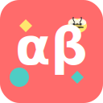

# AlfaBeta - Aplicação Educativa para Alfabetização Infantil

AlfaBeta é uma aplicação web interativa e educativa voltada para a alfabetização infantil. Desenvolvida com React, TypeScript e Vite, a aplicação oferece uma experiência lúdica e envolvente para crianças que estão aprendendo a ler, com foco em atividades de formação de palavras e reconhecimento de sílabas.



## 🎯 Funcionalidades

- Interface amigável e colorida, projetada especificamente para crianças
- Interação intuitiva com sistema de arrastar e soltar (drag and drop)
- Diferentes modos de jogo adaptados para o aprendizado progressivo
- Sistema de níveis com dificuldade crescente
- Feedback sonoro ao clicar ou arrastar itens
- Feedback positivo com animação e som ao completar atividades
- Painel de progresso para pais e educadores acompanharem o desenvolvimento
- Utilização da Web Speech API para reprodução de sons em português brasileiro
- Tutorial interativo para ensinar como jogar

## 🎮 Modos de Jogo

### Complete a Palavra
Nesta atividade, a criança deve arrastar as sílabas corretas para formar a palavra correspondente à imagem mostrada. A aplicação fornece feedback sonoro e visual durante a interação.

### Forme a Frase
Modo onde a criança organiza palavras para formar frases simples relacionadas a uma imagem, desenvolvendo a compreensão da estrutura frasal.

### Encontre a Letra
Atividade focada no reconhecimento de letras, onde a criança deve completar palavras com as letras que faltam.

## 📊 Níveis de Dificuldade

- **Nível Iniciante**: Palavras simples com 2-3 sílabas
- **Nível Intermediário**: Palavras com 3-4 sílabas
- **Nível Avançado**: Palavras mais complexas com 4+ sílabas

## 🧱 Tecnologias Utilizadas

- **React + TypeScript**: Base do projeto para uma experiência de usuário fluida e tipagem segura
- **Vite**: Ferramenta de build rápida para desenvolvimento eficiente
- **Tailwind CSS**: Estilização responsiva e amigável
- **React DnD**: Sistema de drag and drop para interação intuitiva
- **Framer Motion**: Animações lúdicas e suaves para engajar as crianças
- **Web Speech API**: Reprodução de sons e palavras em português brasileiro
- **React Query (TanStack Query)**: Gerenciamento de estado e dados
- **Context API**: Gerenciamento de estado global da aplicação

## 🚀 Como Executar

1. Clone o repositório:
   ```
   git clone https://github.com/leandrogasque/KidsAlphabete.git
   cd KidsAlphabete
   ```

2. Instale as dependências:
   ```
   npm install
   ```

3. Execute o servidor de desenvolvimento:
   ```
   npm run dev
   ```

4. Acesse a aplicação em seu navegador em `http://localhost:5173`

## 📦 Build para Produção

Para gerar a versão de produção da aplicação:

```
npm run build
```

Para visualizar a versão de produção localmente:

```
npm run preview
```

## 🖼️ Design e Acessibilidade

- Interface limpa com elementos grandes para facilitar a interação infantil
- Fontes infantis (Fredoka e Comic Neue) para melhor legibilidade
- Cores suaves e vibrantes que atraem a atenção das crianças
- Áreas clicáveis acessíveis para crianças pequenas
- Som claro e com entonação infantil em português brasileiro
- Feedback visual e sonoro para reforço positivo

## 👨‍👩‍👧‍👦 Área dos Pais

A aplicação conta com uma área especial para pais e educadores acompanharem o progresso da criança:

- Estatísticas de uso e aprendizado
- Visualização do progresso por níveis
- Acompanhamento das palavras já dominadas
- Possibilidade de resetar o progresso

## 🤝 Como Contribuir

1. Faça um fork do projeto
2. Crie uma branch para sua feature (`git checkout -b feature/nova-feature`)
3. Faça commit das suas alterações (`git commit -m 'Adiciona nova feature'`)
4. Faça push para a branch (`git push origin feature/nova-feature`)
5. Abra um Pull Request

## 📝 Licença

Este projeto está sob a licença MIT.